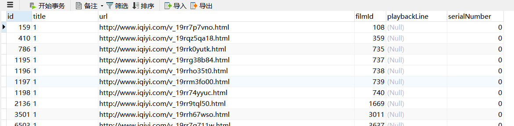
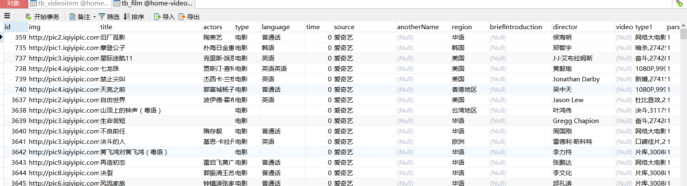

# iqiyiscraper
爱奇艺播放地址爬虫项目

# 项目启动方式

## 导入数据库

- 导入本项目下的`home-video.sql`文件。
- 配置本项目下的`resource/c3p0-config.xml`和`resource/config.properties`中的数据库连接。

## 运行项目

```aidl
mvn package -Dmaven.test.skip=true

cd target

java -jar iqiyiscraper-1.0-SNAPSHOT.jar
```

## 运行效果图
下面是`tb_videoitem`表的内容


下面是`tb_film`表的存储内容


### 注意
本项目只是把爱奇艺上面的视频播放**html地址**爬取并存储下来，并没有把对真实地址进行解析。

如果想要无广告的播放，使用第三方的接口即可，例如：
```aidl
http://mv.688ing.com/player?url=
```
使用方式如下所示：
```aidl
http://mv.688ing.com/player?url=http://www.iqiyi.com/v_19rr7p7vno.html
```
直接拼接url，让后在浏览器打开，就可以播放了。